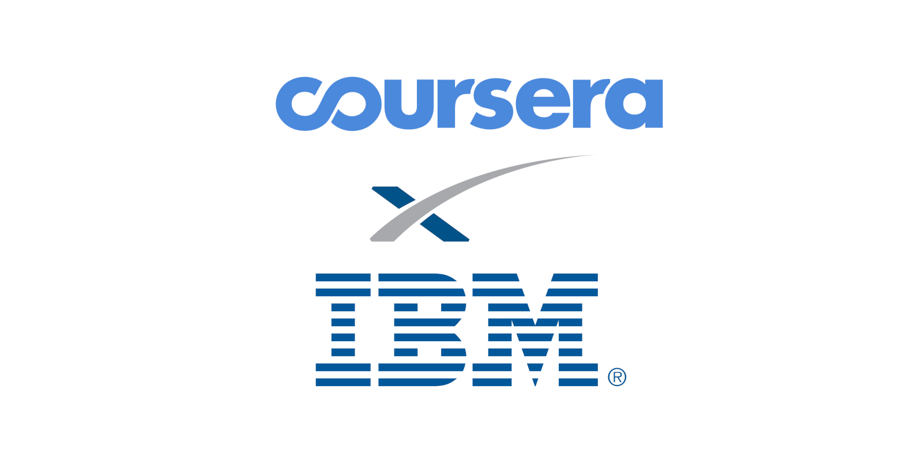
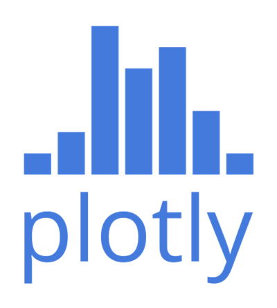

<!-- ABOUT THE PROJECT -->
## About The Project

This project contains a series of Jupyter Notebooks that go through different stages of working with data, it goes from collecting it to 

### Done with

  
  
  
  
  
  
  
  
  
  
  

